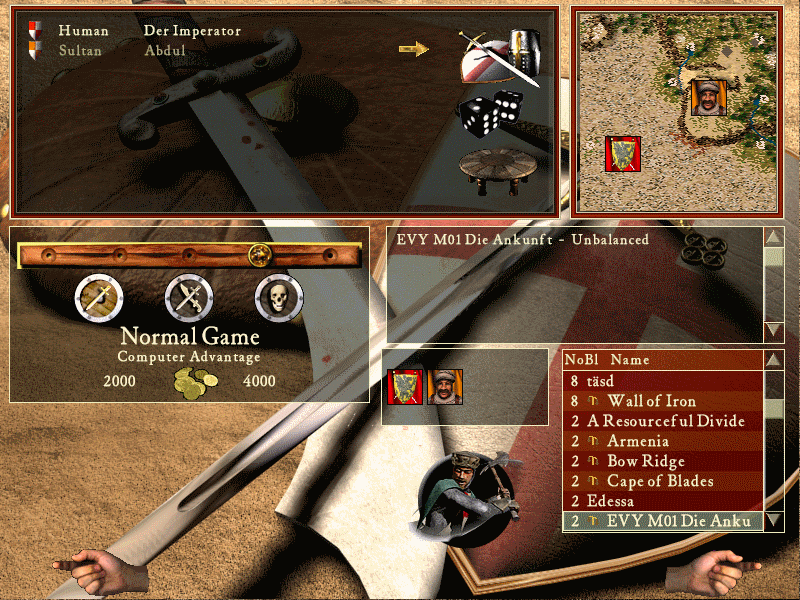

# M01 Die Ankunft

## The Setup

Players from top-left to bottom-right:

- **Sultan** with castle #4, **orange**
- **The player**

Start resources:

- **Normal Game**
- **2000 Gold** Player vs. **4000 Gold** AI

Teams:

- No teams

Optional Challenge:

- Do not use the market.

## Mission Description

### Die Ankunft

Durst, Hunger, Hitze: Eure steten Begleiter auf dieser weiten Reise durch dieses befremdliche Land. Gänzlich anders als in Europa gibt es hier bloß Steine, Felsen, staubtrockene Erde, und gelegentlich Sand, so weit das Auge reicht. Umso wertvoller sind die wenigen grünen Gegenden an Wasserquellen, die man Oasen nennt.

Euer Heer ist am Ende, Ihr seid am Ende. Zu lange musstet Ihr durch dieses Ödland marschieren. Doch Hoffnung tut sich auf! Am Horizont erblickt einer eurer Männer einen Berg, gekrönt mit dem Grün von Bäumen. Dort muss eine Oase sein, dort muss es Wasser geben! Dies ist Eure Chance, neue Kraft zu schöpfen. Doch was ist das? Ein Turm? Es sieht ganz danach aus, als wäre diese Oase bereits besiedelt. Beten wir, dass der heimische Fürst uns wohlgesonnen ist und uns Zutritt zur Oase verschafft.

### The Arrival

Thirst, hunger, heat: Your permanent companions on this long journey through this foreign land. Unlike Europe, there is just stones, rocks, dry earth and occasionally sand as far as the eye can see. The more precious are those few green spots around sources of water, called oases.

Your army is on the ropes, you are on the ropes. For too long you had to cross this barren land. But there is hope! On the horizon, one of your men spotted a mountain, crowned with the greenery of trees. There must be an oasis, there must be water! This is your chance to regain your strength. But what is that? A tower? It looks like someone already settled here on this oasis. Let's pray that the local lord has a friendly attitude towards us, giving us access to the oasis.
