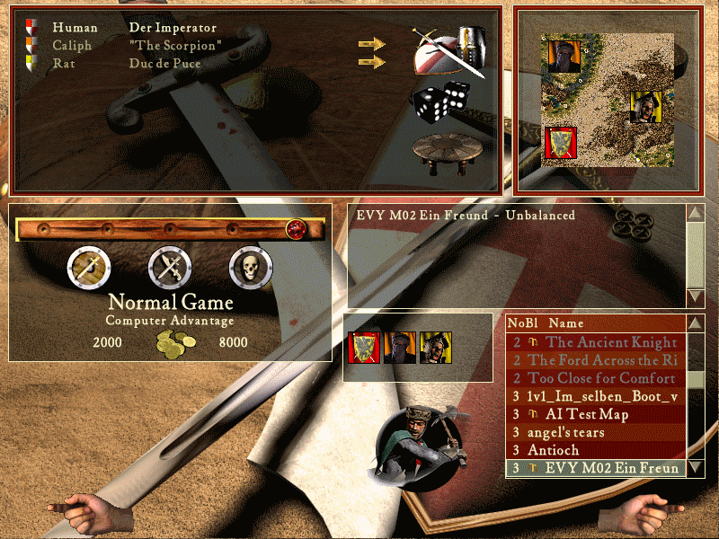

# M02 Ein Freund?

## The Setup

Players from top-left to bottom-right:

- **Caliph** with castle #4, **orange**
- **Rat** with castle #8, **yellow**
- **The player**

Start resources:

- **Normal Game**
- **2000 Gold** Player vs. **8000 Gold** AI

Teams:

- No teams

Optional Challenge:

- Do not use the market.

## Mission Description

### Ein Freund?

Die Tore wurden geschlossen, und in eurer Verzweiflung habt Ihr und Eure Männer die Burg erobert und euch gewaltsam an der Oase gestärkt. Einige konnten jedoch fliehen, einschließlich des Burgherren.

Mit aufgestockten Vorräten seid ihr weitergezogen. Gerüchten zufolge soll sich ein christlicher Fürst in Eurer Nähe aufhalten. Ihr beschließt, dazuzustoßen, um gemeinsam die weitere Reise anzutreten. Und tatsächlich, Herzog de Puce aus einem Teil Aquitaniens errichtete eine Burg umschlossen von schützenden Felsen. Offenbar handelt es sich hierbei eine Trutzburg gegen einen anderen arabischen Fürsten. Der Ungläubige wird wohl kaum gut auf Euch Christ zu sprechen sein, bedingt durch diese Nachbarschaft. Erst recht nicht, falls er von Eurem zuvor verursachten Massaker gehört hat. Ob Herzog de Puce Eure Hilfe annehmen wird? Die Oase des Heiden ist groß genug, um sie zu teilen...

### A Friend?

The gates were closed and in your desperation you and your men conquered the castle and took the oasis by force. Some could flee, including the local arabian lord.

With restocked provisions you continued your march. Rumors say that a christian lord would be near your position. You decide to join him, continuint the journey together. And in fact, duc de Puce of some part of Aquitaine, constructed a castle surrounded by protective rocks. It seems to be a counter-castle against an other arabian lord. This infidel surely wouldn't welcome you, thanks to his current neighbour. Especially not if he heard from your latest carnage. Perhaps duc de Puce will accept your help? The infidel's oasis surely is large enough to be shared...
